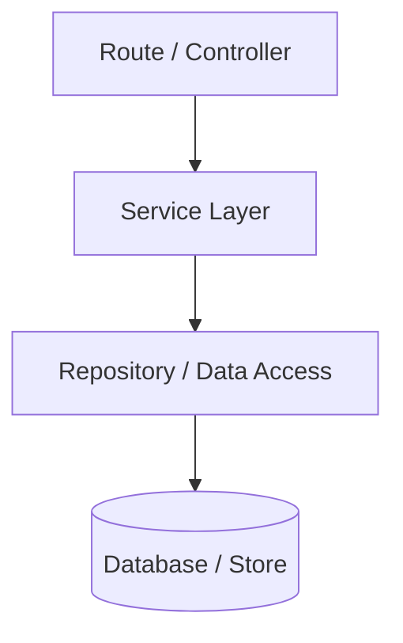
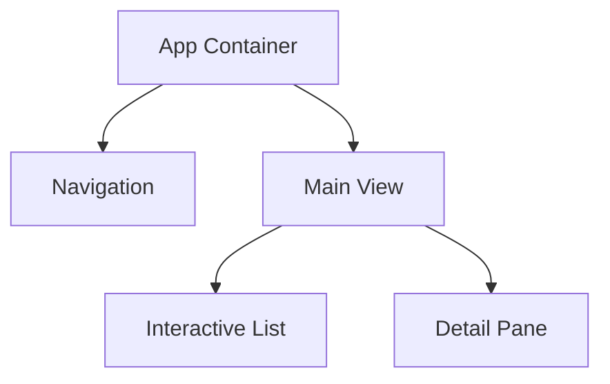

# Graphify: Codebase Knowledge Graph & Architecture Analysis

Graphify extracts and models structural relationships (AST nodes, imports, exports, functions, classes, and database schemas) across the codebase into an explicit knowledge graph.

## Capabilities & Workflows

### 1. Structural Dependency Mapping
- Analyze entry points, module boundaries, and dependency hierarchies.
- Trace upstream dependencies (callers) and downstream dependencies (callees) before modifying shared functions or interfaces.

### 2. Architecture & Data Flow Visualization
When explaining or planning complex architectural changes, generate clean Mermaid diagrams:

#### Module Call Flow

#### State / Component Hierarchy

### 3. Blast Radius & Impact Assessment
Before modifying or deprecating an exported function, type, or database column:
1. Search all occurrences across the workspace.
2. Identify all consumers and dependent test suites.
3. Validate that updates do not create circular dependencies or break contracts.
