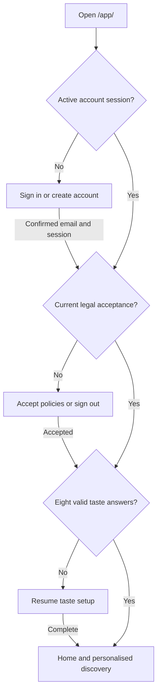

# Palateo app flow

**Baseline:** Current source, 7 October 2026 · **Owner:** Aayush Mittal

## Entry and waitlist

`palateo.in/` → public landing → email + Ahmedabad/Vadodara/Other + launch-email consent → submit → success or retryable error. A waitlist signup creates neither an app account nor email verification. “Explore the beta” opens `/app/`. Privacy and terms are public routes.

## Account creation and restoration

Signup collects full name, phone, email, password and two affirmative policy choices. Supabase returns a user but normally no session until email confirmation: show “Confirm your email, then sign in.” Resend confirmation is available. Failed or expired email links show an error and a route to request another email.

Sign-in requires an active session. An existing account missing the current legal version reaches the consent gate before taste/account features. Declining signs out. After acceptance, restore that account’s profile, complete taste answers, saved IDs and ordered feedback history. Missing or invalid taste answers resume setup; an active retake is preserved rather than overwritten by cloud restoration. Changing accounts clears the previous account’s local profile/preferences; stale cloud responses cannot replace another account’s state.

Forgot password → request recovery email → follow link to `/app/` → dedicated new-password and confirmation form → validate matching passwords of at least eight characters → Supabase update → normal gates/Home. Failed updates stay on the form with an error.

## Taste setup and discovery

Answer mood → cuisine → diet → budget → spice → occasion → priority → travel range. Each step needs a valid choice; Back edits earlier answers. Completion unlocks Home locally and attempts cloud sync. Failure reports “Saved on this device; cloud sync failed.” Profile → retake hides personalised screens until the new eight-answer profile is complete.

Home presents estimated matches and reasons. Discover offers search/filter/sort and venue cards; directions open Google Maps externally. People contains labelled sample profiles, not evidence of real users or a live social directory.

Manual city selection clears temporary coordinates and browses the chosen city. “Use my location” requests browser permission; denial/unavailability preserves manual choice. Outside the supported-city proximity threshold, ask for manual selection. A finite range applies only with location: exclude unknown/invalid venue coordinates. Without location, disclose whole-city browsing. “Anywhere” imposes no distance limit. Precise coordinates are temporary device state, not cloud account history.

## Feedback, saves and failures

- Like / Not for me / I visited immediately replaces the venue’s active feedback and rebuilds learning. Tap the same action again to undo. Writes queue in order; restoration replays additions/removals to the final state. A failed feedback write retains local pending feedback and displays the sync failure; there is no guaranteed automatic retry service.
- Save toggles the shortlist. Cloud failure rolls back the entire attempted save change to the previous shortlist. If the save succeeds but activity logging fails, retain the saved result and explain the partial failure. Venues absent from the cloud catalogue save on this device only.
- Saved resolves venue IDs independently of discovery city and distance filters. Empty Saved links to Discover. Cloud restoration failure keeps available account-local state and reports incomplete sync; a failed initial authentication connection stays gated.

## Privacy and planned deletion

Profile → privacy request email to palateo.com@gmail.com → manual ownership verification → access/correction/export/deletion handling. Sign-out clears browser account preferences; it does not delete the cloud account. A future deletion workflow should confirm account-versus-waitlist scope, eligible data removal and retention/backups before confirming completion. Operator: Aayush Mittal, 937, GIDC Makarpura, Vadodara.

References: [PRD](PRD.md), [app](../work/palateo_cloudflare_pages/app/index.html), [waitlist](../work/palateo_cloudflare_pages/waitlist.js), [privacy](../work/palateo_cloudflare_pages/privacy/index.html), [terms](../work/palateo_cloudflare_pages/terms/index.html).
